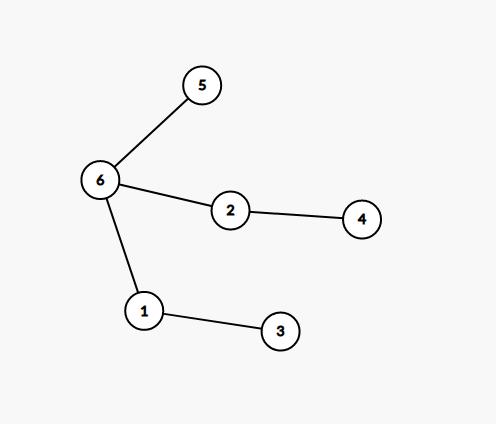
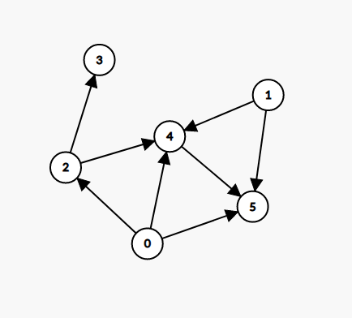

# STL i wstęp do teorii grafów

## Czym jest STL?

Gdybyśmy dostali 50 zadań o treści ,,napisz sortowanie'', to najprawdopodobniej napisalibyśmy raz funkcję sortującą, którą potem wklejalibyśmy do każdego rozwiązania. To całkiem zdroworozsądkowe rozwiązanie, szczególnie w przypadku funkcji, których pisanie wielokrotnie jest uciążliwe.

Z tego właśnie powodu dzisiaj poznamy bibliotekę STL, która jest zbiorem przydatnych algorytmów i
struktur danych. Wystarczy załączyć ją na początku kodu poleceniem ```#include```, po załączeniu
możemy skorzystać z każdej funkcji dostępnej w bibliotece, np. sortującej :)

### Po co nam algorytmika, skoro wszystko jest w STL?

Rozwiązując zadania olimpijskie będziecie często korzystać z biblioteki STL, ale nie zastąpi nam
ona kreatywnego myślenia. Dużo bardziej rozwijające jest samodzielne zaimplementowanie funkcji,
ponieważ wiemy dokładnie, jak ona działa (zamiast traktowania jej jak blackboxa) i mamy możliwość
dopasowania jej pod nasze potrzeby. Dlatego też zaczęliśmy kurs od różnych algorytmów sortujących.

### Przydatne struktury danych i algorytmy, których będziemy używali w zadaniach olimpijskich

Tak jak znamy słowo algorytm, to struktura danych już niekoniecznie. Strukturą danych nazwiemy pewien
obiekt, który przechowuje konkretny typ danych (np int, string) i umożliwia nam w prosty sposób operowanie na nich. Przykładowo, strukturą danych mogłaby być struktura ```centrum handlowe```, która
umożliwiałaby operacje ```dodaj produkt``` i ```ktory produkt jest najdrozszy```.

Definijąc (opisując) naszą strukturę raz, będziemy mogli później stworzyć 100 różnych centrów handlowych, każdy z nich mógłby przechowywać różne produkty.

Poniższe struktury i algorytm sortujący są opisane w odpowiednich plikach w katalogu.
Sugerowana kolejność czytania:

| Struktura / algorytm |
| ------  |
| vector  |
| queue   |
| map |
| priority_queue |
| sort() |

## Teoria grafów
Pora na garść teorii (grafów).

Graf to zbiór wierzchołków połączonych krawędźmi.



Na powyższym rysunku wyróżnione są wierzchołki 1, 2, 3, 4, 5 oraz krawędzie (6, 5) (1, 6) (2, 6)
(2, 4) (1, 3).

W powyższym przypadku mamy do czynienia z grafem ```nieskierowanym```, czyli takim, że krawędź (1, 6)
jest taką samą krawędzią jak (6, 1).

Kiedy kolejność podawania wierzchołków na krawędzi ma znaczenie, to mówimy o grafie ```skierowanym```.



Całkiem popularnym myśleniem o grafie jest traktowanie go jako zbioru miast (wierzchołki) połaczonych drogami (krawędzie). Wtedy dla grafu skierowanego, drogi byłyby tylko jednokierunkowe. Istnienie krawędzi (A, B) znaczyłoby, że dojazd z miasta A do miasta B jest możliwy. Nie gwarantowałoby to jednak możliwości dojazdu z B do A.


### Drzewa, cykle i ścieżki

Ścieżka jest pewnym ciągiem wierzchołków takich, że pomiędzy kolejnymi istnieje krawędź.

Cykl to taka ścieżka, która zaczyna się i kończy w tym samym wierzchołku. Zakładamy, że cykl ma conajmniej jedną krawędź.

Drzewo to specyficzny graf, charakteryzujący się pewną własnością - z każdego wierzchołka do każdego istnieje dokładnie jedna najkrótsza ścieżka. Idzie za tym kilka własności, pomagających nam stwierdzić, czy graf jest drzewem. Na przykład, drzewo o ```N``` wierzchołkach ma ```N-1``` krawędzi.
Drzewa nie mają również cykli (są acykliczne).


### Jak reprezentować graf w pamięci

Niezależnie, czy dany nam w zadaniu graf jest drzewem, chcielibyśmy móc w jakiś sposób zapisać go w pamięci komputera. Podejścia są dwa.

* Podejście macierzowe - dla grafu o N wierzchołkach, tworzymy tablicę Graf[N][N] wypełnioną wartościami
  true i false. Jeśli wierzchołki A i B łączy krawędź, to Graf[A][B] = true i Graf[B][A] = true (jeśli nieskierowany)
* Podejście wektorowe - dla grafu o N wierzchołkach, tworzymy tablicę wektorów Graf[N].
    Jeśli istnieje krawędź łącząca A i B, to wtedy w Graf[A] powinna się znaleźć wartość B. Analogicznie w Graf[B] powinna się znaleźć wartość A.

Plusy i minusy obu reprezentacji.

Podejście macierzowe -> proste w implementacji, słabe pamięciowo. Tworzymy ogromną tablicę, która
w większości będzie wypełniona zerami. W zamian szybko możemy odczytać, czy dwa wierzchołki łączy krawędź ```O(1)```. Dodatkowo, nie możemy rozpatrywać grafów z liczbą wierzchołków większą niż 1000.

Podejście wektorowe -> Troszkę cięższe w implementacji, ale bardzo szanuje pamięć. Trzymamy w tablicy tyle wartości, ile jest krawędzi. Za to sprawdzenie, czy wierzchołki łączy krawędź jest logarytmiczne.
Dużo popularniejsze od macierzowego.


Zadanka
Zadania z STL są na SIO2.

Zadania z teorii grafów
1) (Zadanie bankiet OIG) Mamy N zawodników olimpiady w restauracji, siedzących przy okrągłych stołach.
Każdy zawodnik mówi, którego zawodnika ma po swojej lewej. Ile jest stołów?
2) (Zadanie Gildie OI na szóstkę)
3) (SIO2) Osiągalność wierzchołków
4) (Love Triangle CF#464) Każdy samolot kocha pewien inny samolot. Czy istnieje cykl wielkości 3?

