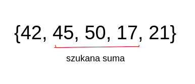

# Sumy prefiksowe i wyszukiwanie binarne

Poznaliśmy już kilka prostych algorytmów sortujących. Dzisiaj zajmiemy się czymś innym,
jednak zastosowania sortowań będziemy mogli dostrzec zarówno dziś, jak i na każdych
kolejnych zajęciach.

## Prefiksy
------


Na początek, dla większości pewnie nowe słowo, czyli ***prefiks***. Prefiksem obiektu nazywamy pewien jego spójny fragment, którego początek jest również początkiem obiektu. Na przykład, prefiksem słowa
"programista" jest słowo "pro". Prefiksem "programisty" jest również "program".
Prefiks może dotyczyć nie tylko słów, możemy również mówić o prefiksie tablicy.

```C++

int tab[] = {1, 2, 3, 4, 4};

```

Prefiksem tablicy tab jest tablica {1, 2, 3} lub tablica {1, 2, 3, 4}.

## Sumy prefiksowe

N dzieci stoi w kolejce, każde z nich waży pewną liczbę kilogramów. Chcielibyśmy móc odpowiadać na
zapytania, ile waży pierwsze K dzieci z kolejki. Możemy założyć, że K jest nie większe od N.

Dla przykładu, jeśli wagi kolejnych 5 dzieci w kolejce to ``` 60, 30, 40, 40, 62 ```, to odpowiedzi dla
K = 1, 2, 3, 4, 5 byłyby równe odpowiednio ```60, 90, 130, 170, 232```.

### Podejście pierwsze, czyli rozwiązujemy brutalnie

Dla każdego zapytania możemy przechodzić pętlą po tablicy z zapisanymi wagami dzieci i sumować dopóki nie zliczymy tylu dzieci, o ile pytano. Oczywiście jest to rozwiązanie poprawne, jednak jego złożoność to O(NK). Spróbujemy zrobić to szybciej.

### Podejście drugie, może coś poprawimy?

Zauważmy, że dla każdego zapytania przechodzimy pętlą wielokrotnie ten sam fragment. Cały czas sumujemy pewien
***prefiks*** tablicy.

Pomysł --- stwórzmy tablicę ```SumyPref```, w której na ```i```-tym indeksie będzie suma wag wszystkich dzieci do
```i```-tego włącznie.

Jak to zrobić?

Dla każdego indeksu ```i``` możemy przejść pętlą od 1 do ```i```-tego dziecka i zapisać sumę napotkanych wartości. Złożoność? O(N*N), czyli równie zła, jak O(KN) :(.

Ale zauważmy pewną własność. Jeśli policzymy ```SumyPref[i]```, to ```SumyPref[i+1]``` mamy właściwie za darmo, ponieważ wystarczy dodać do ```SumyPref[i]``` wagę ```i+1```-ego dziecka. Możemy zatem zapisać algorytm liczący
wartości ```SumyPref``` podczas jednego przejścia liniowego.

```C++
int Wagi[5] = {60, 30, 40, 40, 62};
int SumyPref[5];
SumyPref[0] = Wagi[0];
for (int i = 1; i < N; i++) {
    SumyPref[i] = SumyPref[i-1] + Wagi[i];
}
```

Ćwiczenie: Jakie wartości przyjmie tablica SumyPref dla takiej grupy dzieci:
N = 7
3 1 12 8 4 2 8

### Ostateczne rozwiązanie zadania

Wyznaczamy wartości tablicy ```SumyPref```, następnie na zapytania odpowiadamy po prostu odczytując wartości z tej tablicy. Złożoność --- O(N + K).

Zagadka: Czy potrafimy za pomocą tablicy ```SumyPref``` odczytywać również sumy wag na dowolnych fragmentach,
niekoniecznie prefiksach?




Tak!

```C++
int dajSumeZPrzedzialu(int a, int b) {
    if (a == 0) { return SumyPref[b]; }
    else { return SumyPref[b] - SumyPref[a-1]; }
}
```

### Zadanka na zastosowanie sum prefiksowych

1) W Bajtocji odbędzie się N koncertów następujących po sobie, każdy z nich będzie miał pewien współczynnik fajności. Możemy pójść tylko na spójny fragment K kolejnych koncertów. Jaka będzie sumaryczna fajność maksymalna?

2) [trudne] Bajtosia dostała od Bajtoszka batonik. Batonik jest długi, składa się z N segmentów, z których każdy ma pewną
smaczność. W szczególności, niektóre segmenty mają rodzynki, więc ich smaczność jest ujemna. Znajdź spójny kawałek o maksymalnej sumie.

3) [trudne] Dla danego słowa, ile jest spójnych fragmentów, w których liczba wielkich i małych liter jest równa?
------

## Wyszukiwanie binarne

Zagrajmy w 10 pytań, ja myślę o pewnej liczbie, a Ty możesz podawać różne wartości. Będę odpowiadała, czy podana
przez Ciebie wartość jest większa, czy mniejsza niż moja liczba. Liczbę wybieram z zakresu ```<0, 1000>```.

Całkiem logiczną strategią w tej grze jest dzielenie przedziału na połowy, w którym szukamy liczby.
Najpierw spytamy o 500, potem w zależności od odpowiedzi o 250 lub o 750. W ten sposób cały czas zawężamy obszar przeszukiwania o połowę.

```C++

int pocz = 0;
int kon = 1000;
while (pocz < kon) {
    int srodek = (pocz + kon + 1)/2;
    if (czyWieksza(srodek)) {
        kon = srodek - 1;
    } else {
        pocz = srodek;
    }
}

```

Ten algorytm nazywamy algorytmem wyszukiwania binarnego.
Zgadywanie musi mieć sens -- np. w powyższym zadaniu mogliśmy przyjąć założenie, że jeśli ```środek```
jest większy od mojej liczby, to każda liczba większa od ```srodek``` również jest większa. Jednocześnie
wiedzieliśmy, że istnieje taki ```srodek```, że wszystkie mniejsze od niego są mniejsze od mojej liczby.


Ćwiczenie:
Oblicz pierwiastek liczby naturalnej N.

```C++
int pocz = 0;
int kon = N;
while (pocz < kon) {
    int srodek = (pocz + kon + 1)/2;
    if (czyWieksza(srodek)) {
        kon = srodek - 1;
    } else {
        pocz = srodek;
    }
}
```

Jak będzie wyglądała funkcja czyWieksza()?

```C++
bool czyWieksza(int srodek) {
    return srodek*srodek > N;
}
```

### Crossover nobody asked for, czyli zadanko na deser.

N dzieci dalej stoi w kolejce. Każde z nich ma określoną wagę. Zastanawiamy się, dla kolejnych wind o pewnych wytrzymalościach kilogramowych, ile dzieci weźmiemy (bierzemy kolejno od pierwszego) maksymalnie.

Dla przykładu, dla wag

```
{40, 30, 100, 50, 150, 60}
```

I wind o wytrzymałościach ```70, 350, 180```, możemy zabrać odpowiednio 2, 4 i 3 dzieci.

