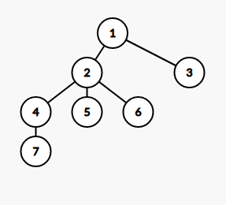

# Spacerujemy po grafach, czyli BFS i DFS

W zeszłym tygodniu poznaliśmy grafy, dowiedzieliśmy się, jaki
graf jest nazywany drzewem oraz jak reprezentować nasze ,,ścieżki'' i
miasta w kodzie. Dzisiaj zajmiemy się metodami poruszania po naszym grafie.

Wprowadźmy kilka pojęć, które przydadzą się w późniejszych
zadaniach. Korzeniem w drzewie nazwiemy wyróżniony wierzchołek,
(najczęściej oznaczony liczbą ```1```).
Drzewo ukorzenione ma wiele ciekawych własności,
na przykład możemy mówić o powiązaniach rodzinnych
między wierzchołkami. Wierzchołki położone bliżej
korzenia są ,,starsze'', przy czym bezpośredni
poprzednik wierzchołka na ścieżce do korzenia
jest nazywany ojcem, analogicznie powiemy o synu.

Zwyczajowo, rysując drzewo umieszczamy korzeń na
samej górze.



Liśćmi nazwiemy wierzchołki, które nie mają dzieci.
Dla przykładu, na powyższym obrazku liśćmi są wierzchołki ```7, 5, 6``` i ```3```.
Ojcem wierzchołka ```5``` jest wierzchołek ```2```,
a synek wierzchołka ```4``` jest ```7```.

### Zadanie na rozgrzewkę

Dla danego drzewa, oblicz ile ma liści.

Hint: Zbadaj liczbę krawędzi wychodzących z liści.

## Przeszukajmy graf

Rozważmy następujący problem. Mamy daną mapę N miast i M
autostrad je łączących. Dla uproszczenia załóżmy, że
przejazd jedną krawędzią zajmuje jedną jednostkę czasu.
W wierzchołku ```1``` znajduje się tłocznia soków
truskawkowych. Codziennie rano wyjeżdżają z niej ciężarówki i dowożą soki do miast. Dla każdego miasta powiedz, po ilu jednostkach czasu dojeżdża do niego ciężarówka z sokiem.

### Rozpoznajemy zadanie grafowe

Mamy tutaj do czynienia ze standardowym zadaniem teorii
grafów, polegającym na obliczeniu odległości między wierzchołkami. Tym razem chcemy obliczyć odległość między ```1```, a wszystkimi innymi wierzchołkami.

Na razie rozwiążemy zadanie dla specjalnego przypadku, kiedy graf jest drzewem, a potem zastanowimy się, jak zmodyfikować algorytm, aby działał dla dowolnego grafu.

## Algorytm BFS

Stwórzmy tablicę, w której będziemy trzymać odległość
z wierzchołka ```1``` do pozostałych wierzchołków.

```C++
int ODL[100000]; // ODL[i] = odległość z 1 do i
                 // Jako wielkość najlepiej ustawić
                 // maksymalną liczbę wierzchołków.
```

Odległość ```1``` od wierzchołka ```1``` jest znana od razu, jest to ```0```. Dla pozostałych wierzchołków
odległość jest nieznana, więc ustawmy wartości
```ODL[i] = -1```. Na przykład w pętli.

```C++
// Funkcja przyjmuje wierzchołek startowy i wypełnia
// tablicę ODL
void przeszukaj_graf(int start) {
    for (int i = 0; i < N; i++) {
        ODL[i] = -1;
    }
    ODL[start] = 0;
}
```

Przejdźmy do algorytmu BFS, czyli naszej metody
poruszania się po grafie.
Nazwa BFS pochodzi od breadth-first search, czyli
przeszukiwania wszerz.
Będziemy przetwarzać wierzchołki warstwami, przy czym
pierwsza warstwa to wierzchołek startowy. Warstwami
oznaczymy zbiór wierzchołków równo oddalonych od startu.
Zrozumieć algorytm pomoże nam animacja, zapożyczona z
Wikipedii.


Najpierw przetworzymy wierzchołki bezpośrednio sąsiadujące z wierzchołkiem startowym, czyli ```b``` i
```c```. Kolejna warstwa odwiedzania, czyli wierzchołki
bezpośrednio sąsiadujące z ```b``` i ```c```, zostaną
odwiedzone dopiero wtedy, gdy cała poprzednia warstwa zostanie przetworzona.

### Przetwarzanie wierzchołka

W jednym kroku algorytmu, dla danego wierzchołka
przeglądamy wszystkich jego sąsiadów i jeśli nie mają
jeszcze dobranej warstwy, to dodajemy ten wierzchołek do kolejki.

```C++
// Przetwarzamy wierzchołek V
for (int i = 0; i < G[V].size(); i++) {
    int sasiad = G[V][i];
    if (ODL[sasiad] == -1) {
        // sasiad nieodwiedzony, nie ma warstwy
        ODL[sasiad] = ODL[V] + 1;
        kolejka.push(sasiad);
    }
}
```

Dzięki naszemu warunkowi, każdy wierzchołek będzie miał
dokładnie raz przypisaną warstwę. Jednocześnie, jeśli
istnieje pewna ścieżka z wierzchołka ```1``` do
```v```, to w pewnym momencie wierzchołek ```v``` trafi na kolejkę.

Pełen algorytm obliczający odległości

```C++

void przeszukaj_graf(int start) {
    for (int i = 0; i < N; i++) {
        ODL[i] = -1;
    }
    ODL[start] = 0;
    queue <int> kolejka;
    kolejka.push(start);

    // Dopóki jeszcze jest coś do przetworzenia
    while (!kolejka.empty()) {
        int V = kolejka.front();
        kolejka.pop(); // właśnie przetwarzamy
        for (int i = 0; i < G[V].size(); i++) {
            int sasiad = G[V][i];
            if (ODL[sasiad] == -1) {
            // sasiad nieodwiedzony, nie ma warstwy
                ODL[sasiad] = ODL[V] + 1;
                kolejka.push(sasiad);
            }
        }
    }

    // kolejka jest pusta, sprawdziliśmy wszystkie warstwy
}

```

Okazuje się, że nasz algorytm wcale nie zmieni się, jeśli graf nie będzie drzewem :). Dla chętnych udowodnić, dlaczego.

### Zadania
1) Sprawdź, czy graf jest drzewem.
2) Z ilu wierzchołków istnieje ścieżka do wierzchołka 1?
3) Ile jest wierzchołków odległych o ```k``` od 1? (Hint: zliczamy ile jest wierzchołków w warstwie)

## Algorytm DFS

Algorytm DFS jest drugim algorytmem przeszukującym
graf. Jest prostszym implementacyjnie, ale
trudniejszym ideowo algorytmem. Przypomina
chodzenie po labiryncie -- idziemy korytarzem dopóki
nie dojdziemy do ślepego zaułka. Wtedy wracamy do pierwszego momentu, w którym mieliśmy do wyboru inny
zakręt i wchodzimy tym razem w niego. Jeśli wykorzystaliśmy wszystkie zakręty, to zawracamy do skutku.

Rozpatrzmy taki problem:
Do jakich miast da się dojechać z naszej tłoczni?

```C++
bool czyDaSie[1000000];

void DFS(int V) {
    czyDaSie[V] = true;
    for (int i = 0; i < G[V]; i++) {
        int sasiad = G[V][i];
        if (czyDaSie[sasiad] == true) {
            DFS(sasiad);
        }
    }
}

```


